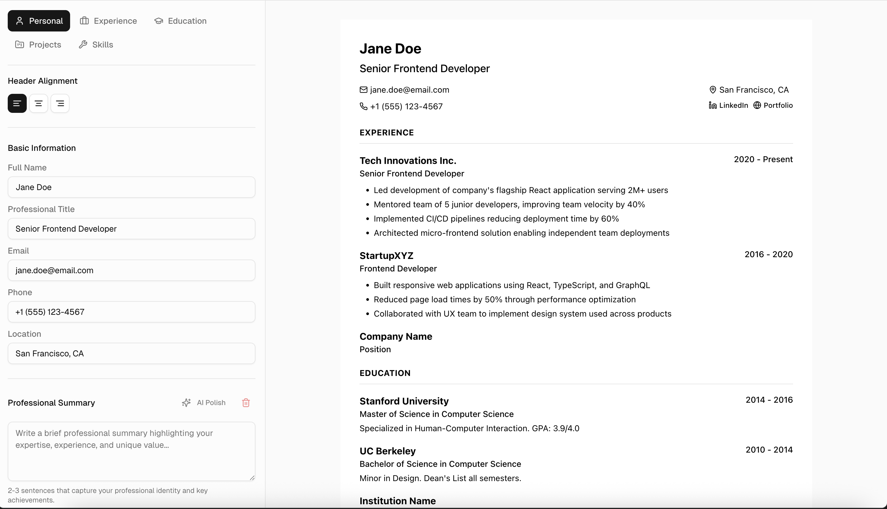
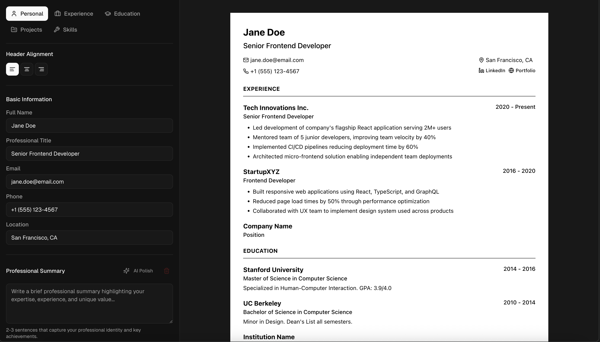

<div align="center">

<h1>✨ Magic Resume ✨</h1>

[](https://nextjs.org/)
[](https://react.dev/)
[](https://www.typescriptlang.org/)
[](https://tailwindcss.com/)
[](https://www.framer.com/motion/)
[](https://tiptap.dev/)
[](https://zustand-demo.pmnd.rs/)
[](https://pnpm.io/)

[](https://x.com/KazakisThanos)
[](https://github.com/ThanosKa/magic-resume/actions/workflows/ci.yml)

<p>AI-assisted CV builder with live preview, AI polish, and one-click export to PDF or JSON.</p>

</div>

## 📸 Screenshots

<div align="center">
  
  
</div>

## What It Does

Magic Resume is a Next.js (App Router) application for creating professional CVs quickly:

- Guided editor for personal info, experience, education, projects, skills, and summaries
- Real-time preview with flexible header alignment and section ordering/toggles
- Import/export JSON, print-friendly view, and server-side PDF generation via Puppeteer
- AI polish (OpenRouter) to improve titles, summaries, and descriptions
- Client-side persistence (Zustand + localStorage) so drafts stay saved between sessions

## Why It’s Useful

- Cuts drafting time with structured inputs and rich text support (Tiptap)
- Keeps design consistent with Radix/Tailwind styling and Framer Motion details
- Export options cover PDF for sharing and JSON for backups or integration
- Privacy-first: data stays local unless you explicitly call the AI polish API

## Getting Started

Prerequisites: Node 18.18+ and pnpm installed.

1. Install dependencies

```bash
pnpm install
```

2. Configure environment (required for AI polish)

```bash
cp .env.example .env.local
# Add your OpenRouter key
OPENROUTER_API_KEY=sk-...
NEXT_PUBLIC_SITE_URL=http://localhost:3000
```

3. Run the app locally

```bash
pnpm dev
# Visit http://localhost:3000 for the landing page and /editor for the builder
```

Useful scripts:

```bash
pnpm lint           # Run ESLint for code quality
pnpm type-check     # Run TypeScript type checking (--noEmit)
pnpm build          # Production build
pnpm start          # Start production server (after build)
pnpm test           # Run all tests once
pnpm test:watch     # Run tests in watch mode for development
pnpm test:coverage  # Generate test coverage report
pnpm seo-check      # Basic SEO sanity checks
```

## Running Tests

Magic Resume uses Vitest for testing and TypeScript for type checking. Tests run automatically on pull requests via GitHub Actions.

```bash
# Run TypeScript type checking
pnpm type-check

# Run all tests
pnpm test

# Watch mode for development
pnpm test:watch

# Generate coverage report
pnpm test:coverage
```

**Note**: API keys are not required for running tests. All external API calls are mocked, so you can use placeholder values in `.env.local` or omit them entirely for testing purposes.

PDF generation requirements:

- Framework preset: **Next.js**. Leave build command as `next build` (default) and output as `.next`.
- For previews, Vercel auto-builds each PR. For production, promote the main branch or trigger a production deployment.
- One-click deploy:

[](https://vercel.com/new/clone?repository-url=https%3A%2F%2Fgithub.com%2FThanosKa%2Fmagic-resume)

**Manual/Other hosts**

- Build locally: `pnpm build`.
- Start: `pnpm start` (expects `.env.local` with required variables).
- Ensure the host supports Node.js 18+ and Next.js server output.

## Project Structure

- `app/` – App Router pages (`/`, `/editor`, API routes)
- `components/landing/` – Marketing sections for the homepage
- `components/editor/` – Editor UI (forms, header, preview, AI polish dialog)
- `components/ui/` – Shared UI primitives (Radix + Tailwind)
- `store/` – Zustand store for CV state and persistence
- `lib/` – SEO helpers and metadata
- `styles/` – Global styles
- `scripts/` – Utilities like `seo-check`
- `types/` – Shared CV typings and defaults

## Getting Help

- File an issue or discussion in the repository with reproduction details.
- Review `app/` and `components/` for implementation references; `scripts/seo-check.js` can help validate SEO metadata locally.

## Maintainers & Contributing

- Maintained by the Magic Resume team. For questions or proposals, open an issue.
- **Contributions are welcome!** Please read our [Contributing Guidelines](CONTRIBUTING.md) before submitting a pull request.
- We follow a [Code of Conduct](.github/CODE_OF_CONDUCT.md) to ensure a welcoming environment for all contributors.

### Quick Start for Contributors

- Fork and create a feature branch.
- Keep PRs scoped; include before/after context for UI changes (screenshots or short GIFs).
- Run `pnpm lint` and `pnpm type-check` (and `pnpm build` if you touch build/runtime code) before submitting.
- Prefer existing patterns (Radix + Tailwind, server-first components; guard client-only code).

For detailed contribution guidelines, see [CONTRIBUTING.md](CONTRIBUTING.md).

## Star History

[](https://star-history.com/#ThanosKa/magic-resume&Date)

## Contributions

Contributions are welcome! Please feel free to submit a Pull Request.

### Contributors

<a href="https://github.com/ThanosKa/magic-resume/graphs/contributors">
  
</a>

## Sponsor this Project

If you find Magic Resume helpful and would like to support its development, consider buying me a coffee! ☕

[](https://buymeacoffee.com/thaka)

Your support helps keep the project maintained and allows me to work on new features. Thank you! 🙏

## License

This project is licensed under the GNU Affero General Public License v3.0. See the [LICENSE](LICENSE) file for details.

The AGPL permits commercial use, modification, and redistribution as long as you keep the same license and provide source (including for network use). If you need a different licensing arrangement, please open an issue or contact the maintainer.
